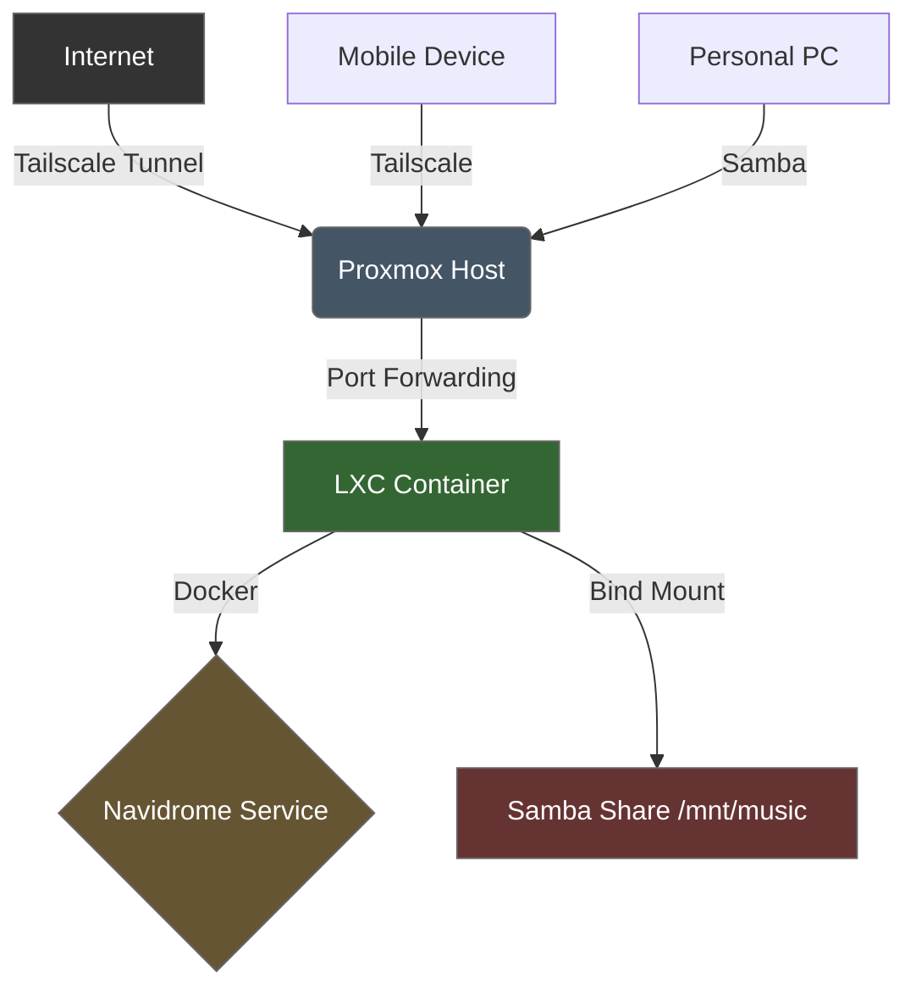

# 🎵 Homelab-Music Server (Navidrome + Docker + Proxmox)
Self-hosted music server using Navidrome on Docker in a Proxmox LXC container with Tailscale remote access

> Self-hosted music streaming server with secure remote access, deployed on Proxmox VE with Docker in an LXC container.


---
## 📖 Overview
This project documents the deployment of a self-hosted music streaming server using **Navidrome** inside a **Docker** container running in an **LXC container** on **Proxmox VE**. The setup includes secure remote access via **Tailscale** and file sharing via **Samba**.

This is not just a tutorial— it's a troubleshooting log that documents the challenges I faced and how I solved them.
---
## 🛠️ Technologies
| Category | Technology | Purpose |
|----------|------------|---------|
| **Virtualization** | Proxmox VE | Host hypervisor for LXC containers |
| **Containerization** | Docker | Orchestrates Navidrome service |
| **Media Server** | Navidrome | Subsonic-compatible music streaming |
| **Remote Access** | Tailscale | Secure mesh VPN tunneling |
| **File Sharing** | Samba | Windows file transfer to host |
| **Networking** | iptables | Port forwarding for container isolation |
| **OS** | Debian 12 | LXC container base system |
---
## 🏗️ Architecture
The data flow follows this path:

## ✨ Features
- Self-hosted music streaming with Navidrome
- Secure remote access via Tailscale (Port Fowarding to LXC via port 4533)
- Containerized deployment with Docker
- Persistent storage via bind mounts
- File transfer from Windows PC via Samba
- Troubleshooting documentation for network isolation issues

## 📋 The Setup

### 1. Infrastructure Provisioning (Proxmox VE)
- Created a Debian 12 LXC container (`DockNavi`) with 3 vCPUs and 2GB RAM
- Enabled **Nesting** in container features to allow Docker execution within LXC
- Configured a **Bind Mount** (`mp0`) to map host directory `/mnt/music` to container path `/music`
```bash
# Proxmox Shell - Create music directory
mkdir -p /mnt/music

# Add bind mount to container config
nano /etc/pve/lxc/100.conf
# Add: mp0: /mnt/music,mp=/music
```
### 2. Container Orchestration (Docker)
- Installed Docker Engine - https://docs.docker.com/engine/install/debian/
- Deployed deluan/navidrome container with port mapping and volume binding

**Set up Docker apt Repository**
```bash
# Add Docker's official GPG key:
sudo apt update
sudo apt install ca-certificates curl
sudo install -m 0755 -d /etc/apt/keyrings
sudo curl -fsSL https://download.docker.com/linux/debian/gpg -o /etc/apt/keyrings/docker.asc
sudo chmod a+r /etc/apt/keyrings/docker.asc

# Add the repository to Apt sources:
sudo tee /etc/apt/sources.list.d/docker.sources <<EOF
Types: deb
URIs: https://download.docker.com/linux/debian
Suites: $(. /etc/os-release && echo "$VERSION_CODENAME")
Components: stable
Signed-By: /etc/apt/keyrings/docker.asc
EOF
```
**Installed Docker Packages**
```bash
 sudo apt install docker-ce docker-ce-cli containerd.io docker-buildx-plugin docker-compose-plugin
#verify
 sudo docker run hello-world
```
**Run Navidrome** - https://www.navidrome.org/docs/installation/docker/
```bash
# Run Navidrome
docker run -d \
  --name navidrome \
  -p 4533:4533 \
  -v /music:/music \
  -v navidrome-data:/data \
  --restart unless-stopped \
  deluan/navidrome:latest
```
### 3. File Sharing & Permissions (Samba)
- Configured Samba on Proxmox host for file transfers from Windows PC
- Resolved permission errors by aligning Linux filesystem ownership with Samba User
```bash
# Proxmox Shell - Install Samba
apt update && apt install -y samba samba-common-bin

# Create Samba user
adduser navidromeuser
smbpasswd -a navidromeuser

# Configure Samba share
nano /etc/samba/smb.conf
# Add: [music] path = /mnt/music browseable = yes read only = no valid users = navidromeuser

# Set ownership
chown -R navidromeuser:navidromeuser /mnt/music
chmod -R 755 /mnt/music

# Restart Samba
systemctl restart smbd
```
### 4. Secure Remote Access (Tailscale)
- Installed Tailscale on Proxmox host for encryptedc mesh network
- Configured iptables NAT port forwarding to bridge host and container
```bash
# Proxmox Shell - Port forwarding
iptables -t nat -A PREROUTING -p tcp --dport 4533 -j DNAT --to-destination 192.168.137.3:4533
iptables -A FORWARD -p tcp -d 192.168.137.3 --dport 4533 -j ACCEPT

# Save rules
apt install -y iptables-persistent
netfilter-persistent save

#Active ip/port forwarding
 sysctl net.ipv4.ip_forward=1
```
### 5. Access Navidrome
- Find your container's IP address
- Open browser and navigate to the Navidrome web interface
- Create admin account on first login
```bash
# LXC Console - Get container IP
hostname -I

# Or check running containers
docker ps
```
**First Login**
Access URL: http://[container-ip]:4533
- Create admin account with username/password
- Music library will auto-populate from /music bind mount
- Navidrome navigate to settings → Users to add regular non-admin user(s)
- Music is now listeneable and accessible via phone download appropiate app for proper OS device using Container IP and Navidrome profile login to access.

## 🚧 Challenges and Troubleshooting
### Challenge 1: Container Network Isolation
| Aspect | Details |
| :--- | :--- |
| **Issue** | Tailscale installed on Proxmox host, but services inside LXC container were unreachable via Tailscale IP |
| **Investigation** | Verified host and container reside in different network namespaces. Local `curl` tests confirmed container was listening, but external traffic was blocked |
| **Solution** | Implemented `iptables` DNAT rules to forward incoming traffic on port 4533 from host to container's internal IP |
| **Lesson Learned** | Understanding network namespaces is critical when deploying services in virtualized environments; external access requires explicit port forwarding rules |
```bash
# Proxmox Shell - Port forwarding
iptables -t nat -A PREROUTING -p tcp --dport 4533 -j DNAT --to-destination 192.168.137.3:4533
iptables -A FORWARD -p tcp -d 192.168.137.3 --dport 4533 -j ACCEPT

# Save rules
apt install -y iptables-persistent
netfilter-persistent save
```
### Challenge 2: Samba Permission Mismatch

| Aspect | Details |
| :--- | :--- |
| **Issue** | Successfully authenticated to Samba share but received "Permission Denied" when attempting to write files |
| **Investigation** | Discovered underlying Linux directory /mnt/music was owned by root, not Samba user |
| **Solution** | Executed chown -R navidromeuser:navidromeuser /mnt/music to align filesystem ownership |
| **Lesson Learned** | Authentication (Samba) and Authorization (Linux Filesystem) are distinct layers; successful login does not guarantee write access without proper file permissions |
```bash
# Proxmox Shell - Set ownership
chown -R navidromeuser:navidromeuser /mnt/music
chmod -R 755 /mnt/music

# Verify ownership
ls -la /mnt/
```
### Challenge 3: Tailscale Installation Failures

| Aspect | Details |
| :--- | :--- |
| **Issue** | Tailscale install script failed with 401 Unauthorized errors from Proxmox enterprise repositories |
| **Investigation** | Proxmox enterprise repos require paid subscription key; apt-get update failed before Tailscale package could install |
| **Solution** | Downloaded .deb package directly and installed with dpkg -i |
| **Lesson Learned** | Repository authentication issues can block package installation; direct .deb download bypasses repo dependencies |
```bash
# Proxmox Shell - Download and install Tailscale directly
curl -fsSL https://pkgs.tailscale.com/stable/debian/bookworm/tailscale_1.60.0_amd64.deb -o tailscale.deb
dpkg -i tailscale.deb
apt-get install -f -y
rm tailscale.deb
```
### Challenge 4: Tailscale Installation Failures

| Aspect | Details |
| :--- | :--- |
| **Issue** | Docker installation script failed with "unsupported file" errors in /etc/apt/keyrings |
| **Investigation** | Unprivileged LXC containers have restricted write access to certain system directories |
| **Solution** | Used mkdir with explicit permissions instead of install command; verified directory writability before proceeding |
| **Lesson Learned** | Unprivileged containers require careful permission management; standard installation scripts may need adaptation |
```bash
# LXC Console - Force create directory
mkdir -p /etc/apt/keyrings
chmod 755 /etc/apt/keyrings

# Verify directory is writable
ls -ld /etc/apt/keyrings
```
### Challenge 5: Port Forwarding & Firewall Blocking

| Aspect | Details |
| :--- | :--- |
| **Issue** | Mobile clients could not connect to Navidrome despite Tailscale showing "Connected". Initial hypothesis pointed to Tailscale relay latency, but the root cause was deeper. |
| **Investigation** | 1. Verified Tailscale status showed "Relayed" but ping worked.<br>2. Tested local connectivity (`curl`) which succeeded, proving the container was running.<br>3. Discovered that while Tailscale traffic reached the Proxmox host, the host firewall (Windows Firewall on the gateway PC) and LXC network isolation were dropping the packets on port 4533. |
| **Solution** | **1. Proxmox Side:** Configured `iptables` NAT port forwarding to bridge the host IP to the LXC container IP.<br>**2. Windows Side:** Created an inbound firewall rule on the PC (acting as the gateway) to allow TCP port 4533 through the Ethernet interface. |
| **Lesson Learned** | In a double-NAT topology (PC sharing internet), traffic must traverse **two** firewalls: the host OS firewall and the container network isolation. Successful remote access requires explicit port forwarding rules on the hypervisor AND allow-listing on the upstream gateway. |

```bash
# Proxmox Shell - Port forwarding (Host to Container)
iptables -t nat -A PREROUTING -p tcp --dport 4533 -j DNAT --to-destination 192.168.137.3:4533
iptables -A FORWARD -p tcp -d 192.168.137.3 --dport 4533 -j ACCEPT

# Windows PowerShell (Run as Admin) - Allow port 4533
New-NetFirewallRule -DisplayName "Navidrome Port 4533" -Direction Inbound -Protocol TCP -LocalPort 4533 -Action Allow
# Alternative: Windows Defender Firewall GUI (which I used)
Created an inbound firewall rule via Windows Defender Firewall app to allow TCP port 4533 through the Ethernet interface.
Advanced Settings → Inbound Rules → New Rule → Port → TCP/Specific local ports: 4533 → Allow connection: Domain, Private, Public → Navidrome/port forwarding 4533 to access navidrome via tailscale → Finish
```

