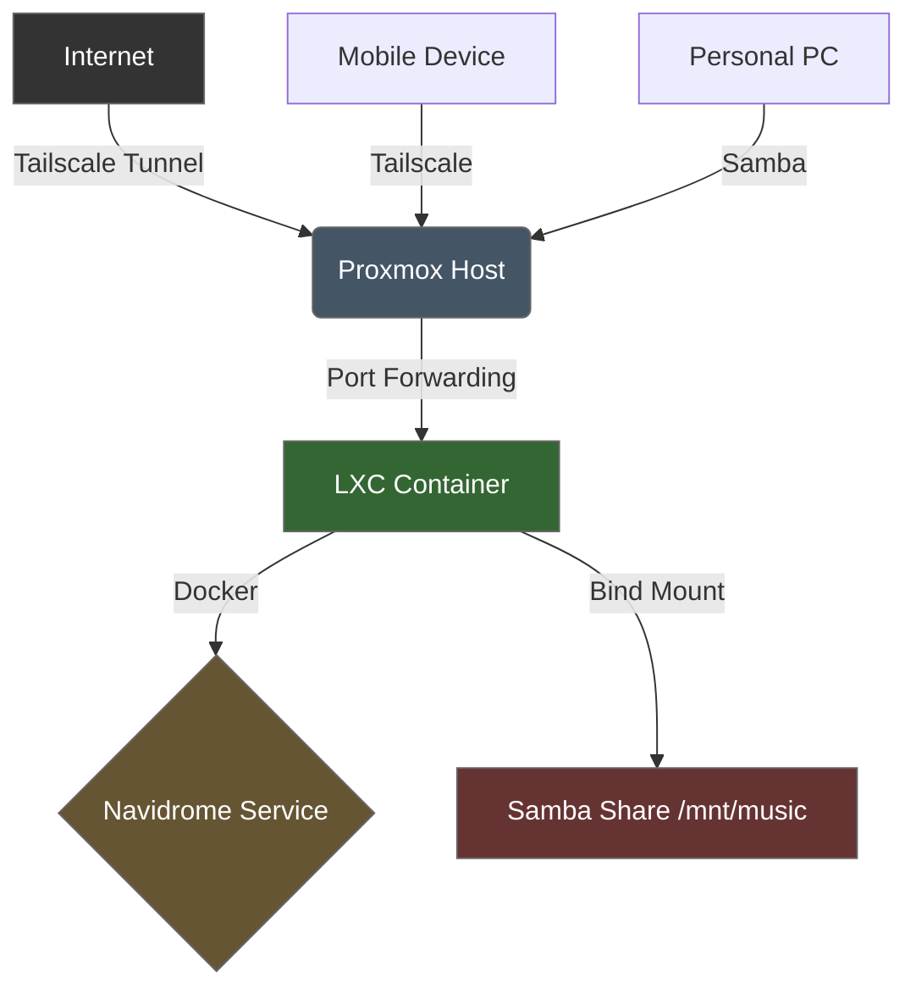

# 🎵 Homelab-Music Server (Navidrome + Docker + Proxmox)
Self-hosted music server using Navidrome on Docker in a Proxmox LXC container with Tailscale remote access

> Self-hosted music streaming server with secure remote access, deployed on Proxmox VE with Docker in an LXC container.


---
## 📖 Overview
This project documents the deployment of a self-hosted music streaming server using **Navidrome** inside a **Docker** container running in an **LXC container** on **Proxmox VE**. The setup includes secure remote access via **Tailscale** and file sharing via **Samba**.

This is not just a tutorial— it's a troubleshooting log that documents the challenges I faced and how I solved them.
---
## 🛠️ Technologies
| Category | Technology | Purpose |
|----------|------------|---------|
| **Virtualization** | Proxmox VE | Host hypervisor for LXC containers |
| **Containerization** | Docker | Orchestrates Navidrome service |
| **Media Server** | Navidrome | Subsonic-compatible music streaming |
| **Remote Access** | Tailscale | Secure mesh VPN tunneling |
| **File Sharing** | Samba | Windows file transfer to host |
| **Networking** | iptables | Port forwarding for container isolation |
| **OS** | Debian 12 | LXC container base system |
---
## 🏗️ Architecture
The data flow follows this path:


## ✨ Features
- Self-hosted music streaming with Navidrome
- Secure remote access via Tailscale (Port Fowarding to LXC via port 4533)
- Containerized deployment with Docker
- Persistent storage via bind mounts
- File transfer from Windows PC via Samba
- Troubleshooting documentation for network isolation issues

## 📋 The Setup

### 1. Infrastructure Provisioning (Proxmox VE)
- Created a Debian 12 LXC container (`DockNavi`) with 3 vCPUs and 2GB RAM
- Enabled **Nesting** in container features to allow Docker execution within LXC
- Configured a **Bind Mount** (`mp0`) to map host directory `/mnt/music` to container path `/music`

```bash
# Proxmox Shell - Create music directory
mkdir -p /mnt/music

# Add bind mount to container config
nano /etc/pve/lxc/100.conf
# Add: mp0: /mnt/music,mp=/music
```
### 2. Container Orchestration (Docker)
- Installed Docker Engine
- Deployed deluan/navidrome container with port mapping and volume binding

**Set up Docker apt Repository**

```bash
# Add Docker's official GPG key:
sudo apt update
sudo apt install ca-certificates curl
sudo install -m 0755 -d /etc/apt/keyrings
sudo curl -fsSL https://download.docker.com/linux/debian/gpg -o /etc/apt/keyrings/docker.asc
sudo chmod a+r /etc/apt/keyrings/docker.asc

# Add the repository to Apt sources:
sudo tee /etc/apt/sources.list.d/docker.sources <<EOF
Types: deb
URIs: https://download.docker.com/linux/debian
Suites: $(. /etc/os-release && echo "$VERSION_CODENAME")
Components: stable
Signed-By: /etc/apt/keyrings/docker.asc
EOF
sudo apt update
```

**Installed Docker Packages**

```bash
 sudo apt install docker-ce docker-ce-cli containerd.io docker-buildx-plugin docker-compose-plugin
#verify
 sudo docker run hello-world
```


