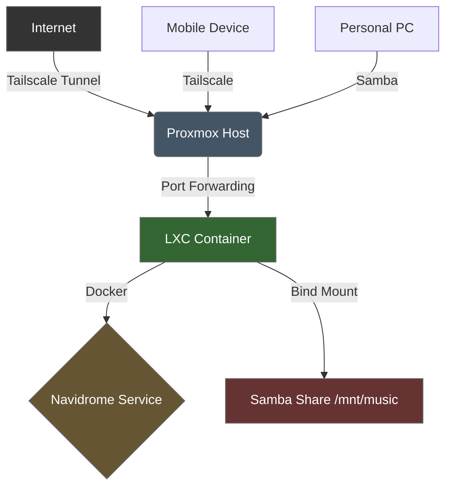

# 🎵 Homelab-Music Server (Navidrome + Docker + Proxmox)
Self-hosted music server using Navidrome on Docker in a Proxmox LXC container with Tailscale remote access

> Self-hosted music streaming server with secure remote access, deployed on Proxmox VE with Docker in an LXC container.

---
## 📖 Overview
This project documents the deployment of a self-hosted music streaming server using **Navidrome** inside a **Docker** container running in an **LXC container** on **Proxmox VE**. The setup includes secure remote access via **Tailscale** and file sharing via **Samba**.

This is not just a tutorial— it's a troubleshooting log that documents the challenges I faced and how I solved them.
---
## 🛠️ Technologies
| Category | Technology | Purpose |
|----------|------------|---------|
| **Virtualization** | Proxmox VE | Host hypervisor for LXC containers |
| **Containerization** | Docker | Orchestrates Navidrome service |
| **Media Server** | Navidrome | Subsonic-compatible music streaming |
| **Remote Access** | Tailscale | Secure mesh VPN tunneling |
| **File Sharing** | Samba | Windows file transfer to host |
| **Networking** | iptables | Port forwarding for container isolation |
| **OS** | Debian 12 | LXC container base system |
---
## 🏗️ Architecture
The data flow follows this path:

## Features
- Self-hosted music streaming
- Secure remote access
- Containerized deployment

## The Setup
- 
